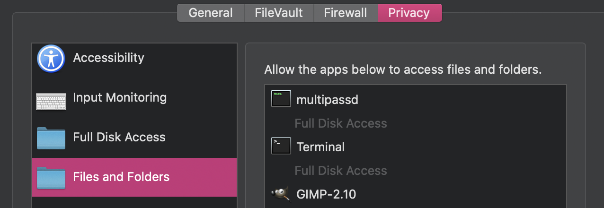

# Setup for Snap Development

## Notes
Currently neither `multipass` or `lxd` have support for cross-platform builds without the use of https://snapcraft.io/build or `snapcraft remote-build`. These solutions are only supported for open-source project development.

## MacOSX

Note: For MacOSX development only amd64 architectures can be built and tested.

Homebrew has a package for snapcraft development:
```bash
brew install snapcraft
```

In order to build, install and test the snap a ubuntu container will be required. The default container for snapcraft development is `multipass`. Multipass is a tool to launch and manage VMs on Windows, Mac and Linux that simulates a cloud environment with support for cloud-init.
```bash
brew cask install multipass
```

### Troubleshooting
If a mount error occurs like the one below:


You need to give `multipassd` explicit access to your disk in order for the mount to be successful. Visit the *System & Privacy* tab in *System Preferences* then check the boxes for `multipassd`. Once applied you should see the access permissions displayed:



## Ubuntu Server 20.04 (RPi)

Note: For Ubuntu Server 20.04 development only `arm64` architectures can be built and tested.
